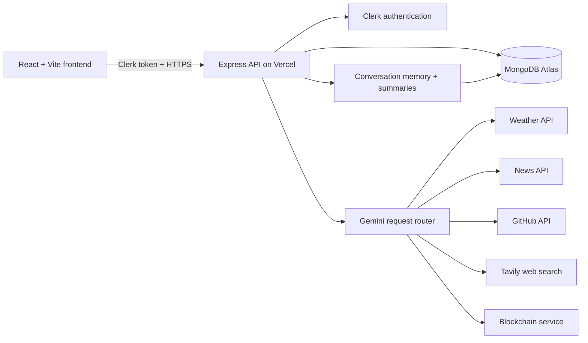

# AI Agents

A production-ready multi-agent AI assistant that routes each user request to the most relevant specialist agent. The application combines a React chat interface, Clerk authentication, an Express API, MongoDB conversation memory, and external data services behind one workflow.

## Live Application

- Frontend: https://frontend-omega-ruby-s9i8nou6sn.vercel.app
- Backend health: https://ai-agents-pied.vercel.app/api
- Repository: https://github.com/Shwetankkarn/ai-agents

## What It Does

Ask one question in natural language and the router selects the best agent:

| Agent | Handles |
| --- | --- |
| Weather | Current weather and forecasts by city and date |
| News | Recent news and topic-based headlines |
| GitHub | User profiles and public repositories |
| Blockchain | Cryptocurrency and blockchain questions |
| Web | General web search and research questions |

The app supports authenticated users, multiple conversations, persistent message history, generated conversation titles, rolling summaries, Markdown answers, code-block copying, online/offline status, and conversation deletion.

## Architecture



### Repository layout

```text
.
├── AI-agents/                 # Express API and agent services
│   ├── agents/                # Weather, news, GitHub, web, blockchain agents
│   ├── api/[...path].js       # Vercel catch-all serverless entrypoint
│   ├── config/db.js           # Cached MongoDB connection
│   ├── models/Conversation.js # Conversation schema
│   ├── router/router.js       # Gemini-powered agent selection
│   ├── services/              # External APIs and conversation memory
│   └── index.js               # Express app and local server entrypoint
├── frontend/                  # React + Vite client
│   └── src/                   # Chat UI, auth flow, and API calls
└── README.md
```

## Request Flow

1. Clerk authenticates the user in the browser.
2. The frontend sends a bearer token and message to `POST /api/chat`.
3. The API verifies the user and loads their MongoDB conversation.
4. Gemini classifies the request and extracts the agent query.
5. The selected specialist calls its external service.
6. The answer and agent metadata are saved to the conversation.
7. The frontend renders the response as Markdown and updates the sidebar.

## API Reference

The production API base URL is `https://ai-agents-pied.vercel.app/api`.

| Method | Route | Auth | Purpose |
| --- | --- | --- | --- |
| `GET` | `/api` | No | Health check |
| `GET` | `/api/conversations` | Clerk | List the current user's conversations |
| `POST` | `/api/conversations` | Clerk | Create a conversation |
| `GET` | `/api/conversation/:id` | Clerk | Load one conversation |
| `DELETE` | `/api/conversation/:id` | Clerk | Delete one conversation |
| `POST` | `/api/chat` | Clerk | Route, answer, and save a user message |

Protected requests require:

```http
Authorization: Bearer <clerk-session-token>
Content-Type: application/json
```

Example chat body:

```json
{
  "conversationId": "mongodb-conversation-id",
  "message": "What is the weather in Delhi tomorrow?"
}
```

## Local Development

### Prerequisites

- Node.js 20+
- MongoDB Atlas or a reachable MongoDB instance
- Clerk application
- API keys for the enabled agents

### Install

```bash
cd AI-agents
npm install

cd ../frontend
npm install
```

### Environment files

Create `AI-agents/.env`:

```env
GEMINI_API_KEY=your_gemini_key
WEATHER_API_KEY=your_weatherapi_key
NEWS_API_KEY=your_newsapi_key
TAVILY_API_KEY=your_tavily_key
MONGODB_URI=your_mongodb_connection_string
CLERK_PUBLISHABLE_KEY=your_clerk_publishable_key
CLERK_SECRET_KEY=your_clerk_secret_key
CLERK_JWT_KEY=your_clerk_jwt_key
CORS_ORIGIN=http://localhost:5173
PORT=3000
```

Create `frontend/.env`:

```env
VITE_CLERK_PUBLISHABLE_KEY=your_clerk_publishable_key
# Leave unset locally when using the Vite proxy.
# Set this for a separately hosted frontend:
# VITE_API_URL=https://ai-agents-pied.vercel.app/api
```

Never commit `.env`, `.env.local`, API keys, database credentials, or Clerk secrets.

### Run the application

Start the backend:

```bash
cd AI-agents
npm start
```

Start the frontend in a second terminal:

```bash
cd frontend
npm run dev
```

Open http://localhost:5173.

### Verify locally

```bash
curl http://localhost:3000/api
npm run lint --prefix frontend
npm run build --prefix frontend
```

The protected conversation routes return `401` without a valid Clerk session. That is expected.

## Deployment

The production setup uses two Vercel projects:

- `ai-agents`: Express serverless API from `AI-agents/`
- `frontend`: Vite static frontend from `frontend/`

Set these frontend Production variables in Vercel:

```text
VITE_API_URL=https://ai-agents-pied.vercel.app/api
VITE_CLERK_PUBLISHABLE_KEY=<clerk-publishable-key>
```

Set these backend Production variables in Vercel:

```text
GEMINI_API_KEY
WEATHER_API_KEY
NEWS_API_KEY
TAVILY_API_KEY
MONGODB_URI
CLERK_PUBLISHABLE_KEY
CLERK_SECRET_KEY
CLERK_JWT_KEY
CORS_ORIGIN=https://frontend-omega-ruby-s9i8nou6sn.vercel.app
```

Deploy from each project directory:

```bash
cd AI-agents
npx vercel --prod

cd ../frontend
npx vercel --prod
```

After deployment, verify:

```bash
curl https://ai-agents-pied.vercel.app/api
```

## Security and Reliability

- Authentication is enforced server-side through Clerk; user IDs are scoped on every conversation query.
- CORS is restricted to the public frontend origin.
- Secrets are stored in Vercel environment variables and ignored locally.
- MongoDB connections are cached and reused across serverless invocations.
- The local Express listener is enabled only outside Vercel; Vercel uses the serverless export.
- External-service failures are converted into user-friendly API messages.

## Current Status

- Frontend and backend deployed publicly on Vercel.
- MongoDB, Clerk, Gemini, Weather, News, Tavily, GitHub, and blockchain flows connected.
- GitHub `master` branch is the source of truth.
- Production health endpoint verified with HTTP `200`.
- CORS preflight verified with HTTP `204`.

## License

This project is currently private-use software. Add a license before distributing it publicly.
